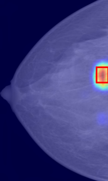
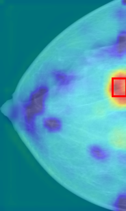
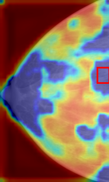
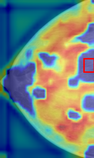
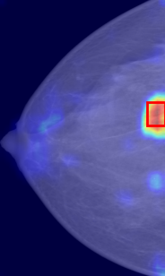
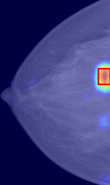
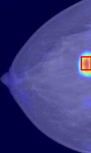

<h2 align="center"> Mammo-SAE: Interpreting Breast Cancer Concept Learning with Sparse Autoencoders [Deep Breast Imaging Workshop, MICCAI 2025 🔥]</h2>


[Krishna Kanth Nakka](https://krishnakanthnakka.github.io/)* 

**Munich, Bavaria, Germany**

<h5 align="center"> If you like our project, please give us a star ⭐ on GitHub for the latest update.</h5>


## 📣 Latest Updates
- **Sep 7-2025**: Partial Code Release. Working to update remaining parts of the code.


## 🔥 Highlights
- **Mammo-SAE**:  First SAE trained on Mammogram Vision-Language Foundation Model (MammoCLIP) to interpret breast concepts such as mass, calcification.
- **Latent Neuron Intervention**: We localise highest activated latent neurons in the presence of breast concepts, and then conduct top-k group intervention to understand the performance on downstream concept prediction
- **Breast Concept Localization**: We visualize the top-k latent neurons that are responsible for downstream performance and study their alignment with ground-truth regions to understand the model behaviour.


---

### Installation

-  To install all required dependencies, run:

    ```sh
    pip install -r requirments.txt
    ```

---

### Pretrained Checkpoints

- **Sparse Autoencoder (SAE) Weights:** Pretrained SAE checkpoints are uploaded to the [Huggingface](https://huggingface.co/KKNakka/MammoSAE).  SAE is trained on the local features of the last layer of the Mammo-CLIP vision embeddings. 

    ```python

    # minimal example to download the MammoSAE
    ckpt_path = hf_hub_download(
        repo_id=f"KKNakka/MammoSAE",
        filename=f"sparse_autoencoder_final.pt",
        repo_type="model"
    )

    print(f"Loading SAE checkpoint from: {ckpt_path}")
    state_dict = torch.load(ckpt_path)

    # load the weights into the SAE
    autoencoder.load_state_dict(state_dict)
    ```

- **MammoCLIP:** Download the pretrained MammoCLIP checkpoints from [Hugging Face](https://huggingface.co/shawn24/Mammo-CLIP) and place them in the `Mammo_CLIP_weights/` directory.  
---

### VinDr Dataset

- We follow similar preprocessing pipeline and scripts from the [Mammo-CLIP](https://github.com/batmanlab/Mammo-CLIP) codebase. Please download all relevant dataset files such as annotations csv file and images. 

- We download the VinDr dataset images from the Kaggle project. Please see [here](https://www.kaggle.com/datasets/shantanughosh/vindr-mammogram-dataset-dicom-to-png) for more details.


### Mammo-SAE Generalization

- Our MammoSAE is trained on the local features of the `finetuned suspicious calcification` prediction model. To understand its effectivness in reconstructing other models (such as for different concept or for different training phase like pretrainign), we conduct the below experiment.

-  We reconstruct the local features at the last layer of the Mammo-CLIP backbone with SAE for different models and concepts,  using

    ```sh
    bash scripts/eval_with_sae_reconstruction.sh
    ```


### Launch Intervention on Mammo-SAE Latent Neurons

- We provide scripts to reproduce Figure 2 using the commands below. 

#### Intervention: Top-k Latent Neurons Activated

- To launch an intervention that activates only the `top-k` neurons, run:

    ```sh
    bash scripts/topk_activate_latent_neuron_intervention.sh
    ```


#### Intervention: Top-k Latent Neurons Deactivated

- To launch an intervention that deactivates only the top-k neurons, run:
    ```sh
    bash scripts/topk_deactivate_latent_neuron_interventions.sh
    ```

### Visualization of Mammo-SAE Latent Neurons

- To visualize the top-k latent neurons, please run:

    ```sh
    bash scripts/visualizations.sh
    ```

- The visualizations are stored in the `./results/visualizations` folder.  For example, given an image, we plot `top-10` latent neurons corresponding to presence of `suspicious calcification` class is shown below:

<p align="center">
  
  
  
  
  
  
  
</p>


## 📝 Citation

If you find this paper or repository useful, please consider staring 🌟 this repo and citing 📑 our paper:

```
@article{nakka2025mammo,
  title={Mammo-SAE: Interpreting Breast Cancer Concept Learning with Sparse Autoencoders},
  author={Nakka, Krishna Kanth},
  journal={Deep Breast Imaging work, MICCAI 2025},
  year={2025}
}
```

## 🙏 Acknowledgement
- This project is built upon [Mammo-CLIP](https://arxiv.org/abs/2405.12255) and [VisionSAE]() codebases. Thank you to both of them for open sourcing their codebases. 
